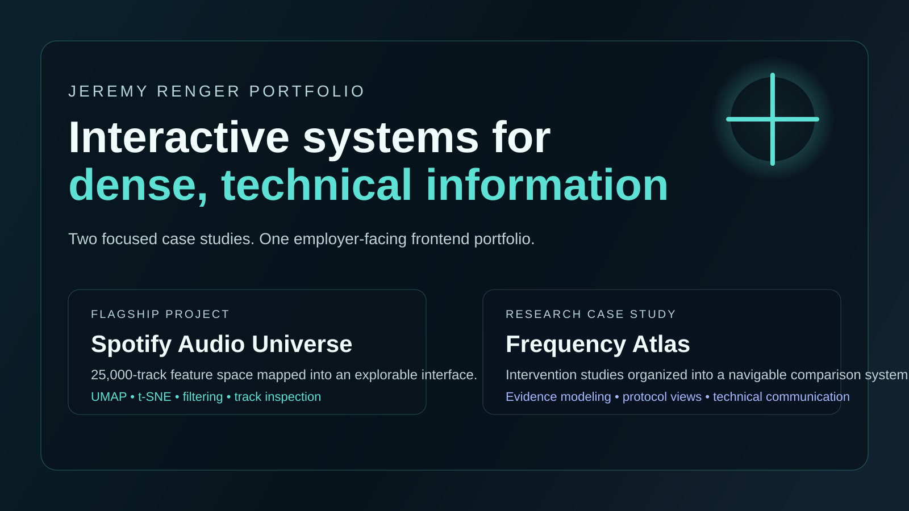

# Jeremy Renger Portfolio

Product-grade frontend work for dense, technical information.



## Overview

This portfolio is a single employer-facing surface built to show how Jeremy Renger approaches interactive systems, data visualization, and research-informed interface design.

It centers on two case studies:

- `Spotify Audio Universe` is the flagship interactive visualization project.
- `Frequency Atlas` is the research interface case study.

Together they show product thinking, frontend execution, and technical communication in one concise surface.

## Featured Projects

### Spotify Audio Universe

A browser-native visualization system that turns a 25,000-track feature space into an explorable interface for clustering, filtering, and track-level inspection.

What it demonstrates:

- frontend-heavy product prototyping
- interaction design for high-dimensional data
- browser-native visualization workflows

### Frequency Atlas

A research interface that organizes intervention studies across frequency bands, evidence levels, and protocol combinations into a navigable atlas.

What it demonstrates:

- translating dense research into a usable system
- interface design for technical communication
- systems thinking across data, presentation, and exploratory analysis

## Tech Stack

- Next.js
- TypeScript
- React
- custom interaction design
- browser-native visualization patterns

## What This Portfolio Demonstrates

- product-minded frontend engineering
- interactive systems thinking
- data visualization for complex information
- research synthesis translated into usable interfaces

## Local Run

```bash
npm install
npm run dev
```

## Project Routes

- `/`
- `/projects/spotify-audio-universe`
- `/projects/frequency-atlas`

## Supporting Artifacts

- `/research/frequency-atlas-download-guide.md`
- `/research/frequency-atlas-research-paper.pdf`

## Notes

- Use the Vercel production URL as the primary public link from LinkedIn and resume materials.
- Pin `portfolio` first on the GitHub profile for the clearest employer-facing story.
